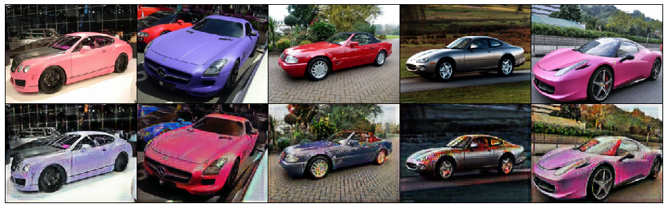
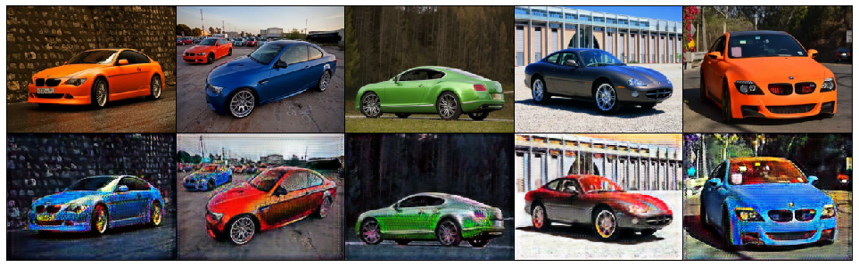
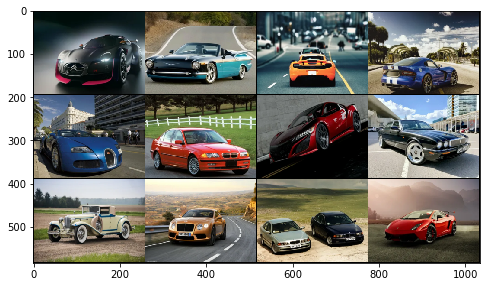
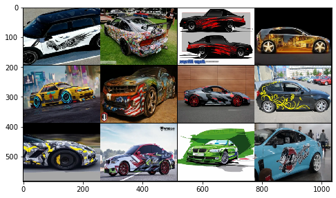

## My CycleGAN implemetation for car styling.

Original paper: [Unpaired Image-to-Image Translation
using Cycle-Consistent Adversarial Networks]

This GAN can paint and style your boring car =)

    
    

Unpaired dataset has ~800 examples of normal cars and ~1000 examples of styled cars:

    
    

